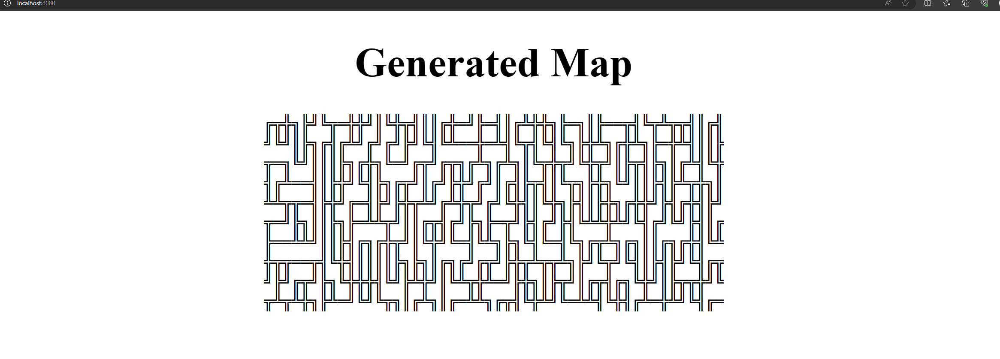
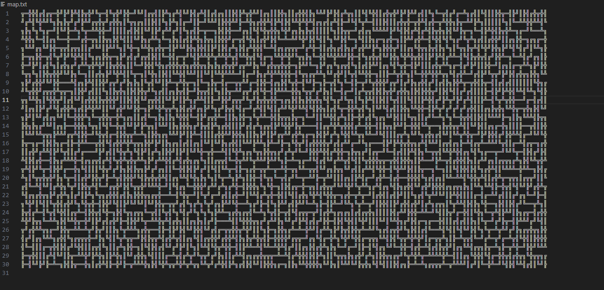

# MAP GENERATOR

## GOAL
Implement the wave collapse functions to generate maps with ASCII Characters

### Characters
Theses are the used characters to build the map
```
	"╣", "╠", "║", "═", "╝", "╚", "╗", "╔", "╩", "╦", "╬"

```

### TODO
- Dockerize ( Multstage build )
- Improve presentation ( HTML, CSS, TXT, etc )
- Create Tests


### HTML RESULT



### TXT RESULT
